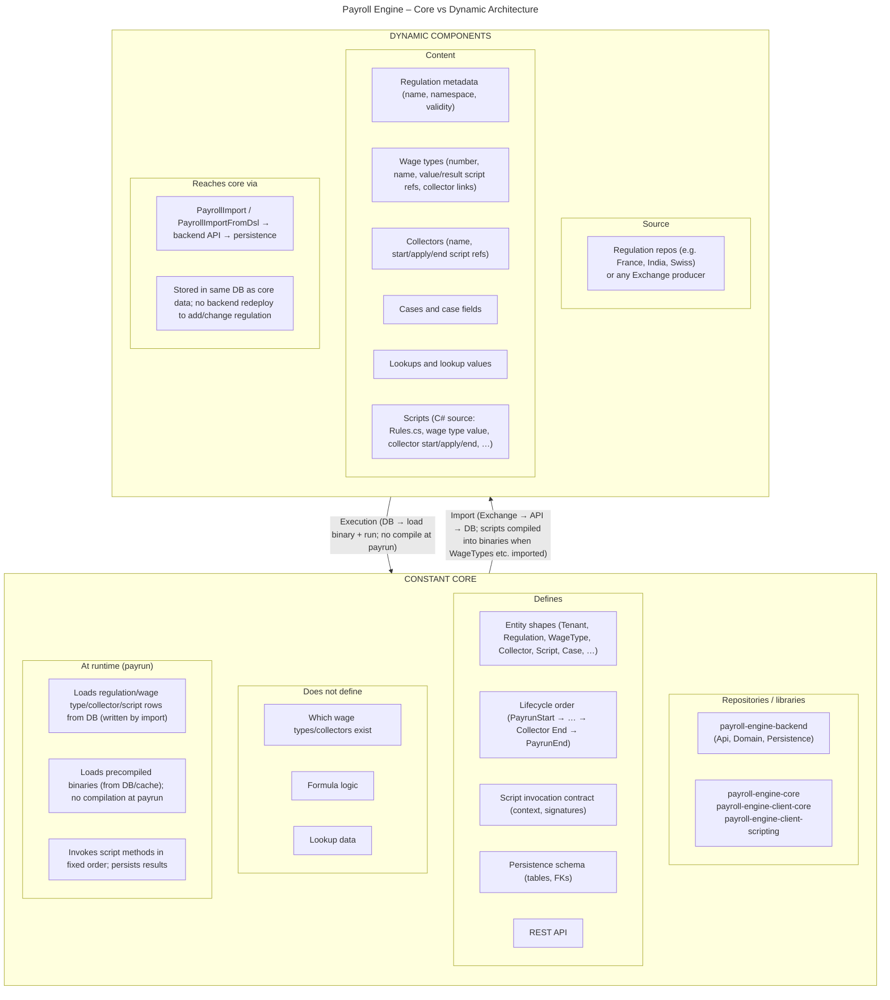
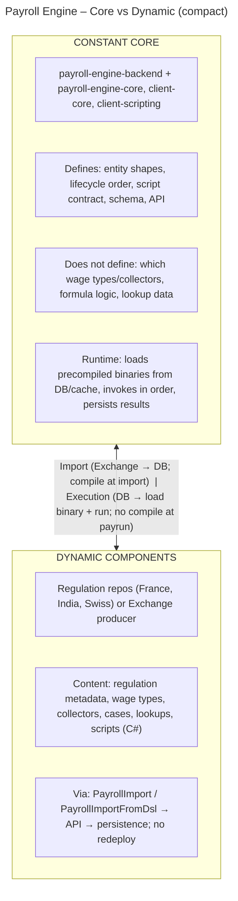

# Payroll Engine Fundamental Architecture – Summary Diagram (Lucid/Mermaid)

Use this Mermaid code in Lucidchart: **Primary Toolbar → Diagram as code icon → + New Mermaid diagram** → paste below → Generate.

---

## Compact variant (single boxes, less detail)

If the full diagram is too dense, use this simplified version:

---

**One sentence** (from doc): The **core** is the generic payroll execution engine (shapes, lifecycle, persistence, API); the **dynamic** part is the regulation metadata and script source that are ingested and stored. Scripts are **compiled at import** (when WageTypes etc. are imported); at **payrun time** only precompiled binaries are loaded and executed—so the engine stays constant while country and tenant logic change freely, with no compilation on the payrun path.
