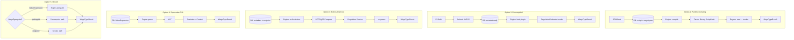

# Diagram 1: Five-option flow comparison

One diagram showing where rule logic lives and how it is executed for each option.

```mermaid
flowchart TB
    subgraph Option1["Option 1: Runtime scripting"]
        A1[API/Client] --> B1[(DB: script + wage types)]
        B1 --> C1[Engine: compile]
        C1 --> D1[Cache: Binary, ScriptHash]
        D1 --> E1[Payrun: load → invoke]
        E1 --> F1[WageTypeResult]
    end

    subgraph Option2["Option 2: Precompiled"]
        A2[CI Build] --> B2[Artifact: JAR/JS]
        B2 --> C2[(DB: metadata only)]
        C2 --> D2[Engine: load plugin]
        D2 --> E2[RegulationEvaluator.invoke]
        E2 --> F2[WageTypeResult]
    end

    subgraph Option3["Option 3: External service"]
        A3[(DB: metadata + endpoint)]
        A3 --> B3[Engine: orchestration]
        B3 --> C3[HTTP/gRPC request]
        C3 --> D3[Regulation Service]
        D3 --> E3[response]
        E3 --> F3[WageTypeResult]
    end

    subgraph Option4["Option 4: Expression DSL"]
        A4[(DB: ValueExpression)]
        A4 --> B4[Engine: parse]
        B4 --> C4[AST]
        C4 --> D4[Evaluator + Context]
        D4 --> E4[WageTypeResult]
    end

    subgraph Option5["Option 5: Hybrid"]
        A5{WageType path?}
        A5 -->|ValueExpression| B5[Expression path]
        A5 -->|packageId| C5[Precompiled path]
        A5 -->|endpoint| D5[Service path]
        B5 --> E5[WageTypeResult]
        C5 --> E5
        D5 --> E5
    end
```
