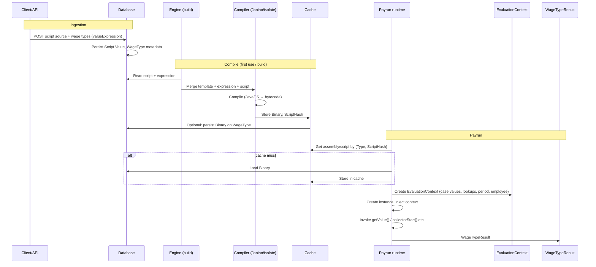

# Diagram 2: Option 1 — Ingestion → Compile → Payrun

Sequence for runtime rules/scripting: persist script and wage types, compile and cache, then invoke at payrun.

```mermaid
sequenceDiagram
    participant Client as Client/API
    participant DB as Database
    participant Engine as Engine (build)
    participant Compiler as Compiler (Janino/isolate)
    participant Cache as Cache
    participant Payrun as Payrun runtime
    participant Context as EvaluationContext
    participant Result as WageTypeResult

    Note over Client,DB: Ingestion
    Client->>DB: POST script source + wage types (valueExpression)
    DB->>DB: Persist Script.Value, WageType metadata

    Note over Engine,Cache: Compile (first use / build)
    Engine->>DB: Read script + expression
    Engine->>Compiler: Merge template + expression + script
    Compiler->>Compiler: Compile (Java/JS → bytecode)
    Compiler->>Cache: Store Binary, ScriptHash
    Cache->>DB: Optional: persist Binary on WageType

    Note over Payrun,Result: Payrun
    Payrun->>Cache: Get assembly/script by (Type, ScriptHash)
    alt cache miss
        Payrun->>DB: Load Binary
        Payrun->>Cache: Store in cache
    end
    Payrun->>Context: Create EvaluationContext (case values, lookups, period, employee)
    Payrun->>Payrun: Create instance, inject context
    Payrun->>Payrun: invoke getValue() / collectorStart() etc.
    Payrun->>Result: WageTypeResult
```
