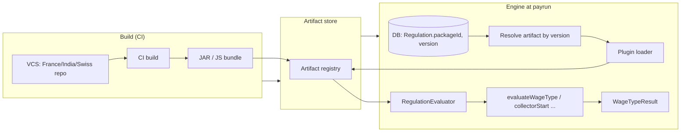

# Diagram 3: Option 2 — Build → Deploy → Run

Pipeline for precompiled regulations: code stays in VCS/CI; engine loads by package id and version only.

```mermaid
flowchart LR
    subgraph Build["Build (CI)"]
        VCS[VCS: France/India/Swiss repo]
        CI[CI build]
        VCS --> CI
        CI --> JAR[JAR / JS bundle]
    end

    subgraph Store["Artifact store"]
        Reg[Artifact registry]
        JAR --> Reg
    end

    subgraph Run["Engine at payrun"]
        DB[(DB: Regulation.packageId, version)]
        DB --> Resolve[Resolve artifact by version]
        Resolve --> Load[Plugin loader]
        Load --> Reg
        Reg --> Eval[RegulationEvaluator]
        Eval --> Invoke[evaluateWageType / collectorStart ...]
        Invoke --> WT[WageTypeResult]
    end

    Build --> Store
    Store --> Run
```
