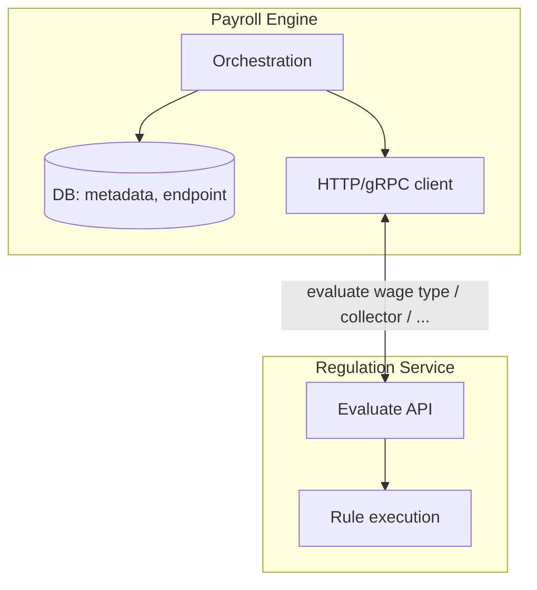
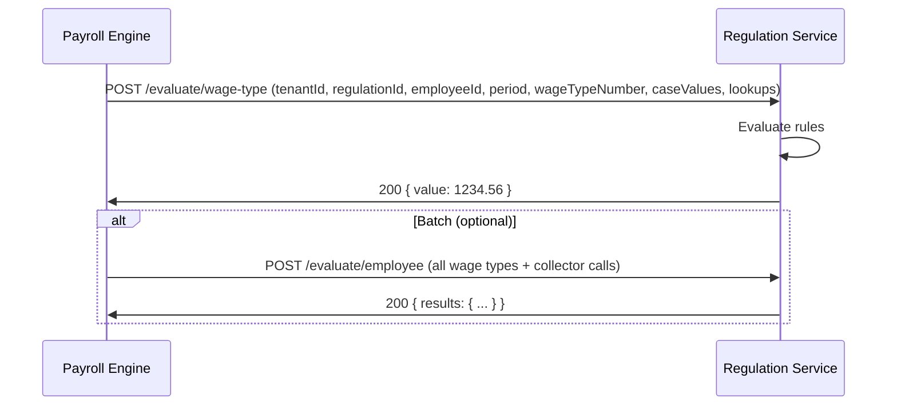

# Diagram 4: Option 3 — Engine ↔ Regulation service

Component view and request/response sequence. Engine does not run rules; regulation service does.

```mermaid
flowchart TB
    subgraph Engine["Payroll Engine"]
        Orch[Orchestration]
        DB[(DB: metadata, endpoint)]
        Client[HTTP/gRPC client]
        Orch --> DB
        Orch --> Client
    end

    subgraph Service["Regulation Service"]
        API[Evaluate API]
        Rules[Rule execution]
        API --> Rules
    end

    Client <-->|"evaluate wage type / collector / ..."| API
```

```mermaid
sequenceDiagram
    participant Engine as Payroll Engine
    participant Service as Regulation Service

    Engine->>Service: POST /evaluate/wage-type (tenantId, regulationId, employeeId, period, wageTypeNumber, caseValues, lookups)
    Service->>Service: Evaluate rules
    Service->>Engine: 200 { value: 1234.56 }

    alt Batch (optional)
        Engine->>Service: POST /evaluate/employee (all wage types + collector calls)
        Service->>Engine: 200 { results: { ... } }
    end
```
